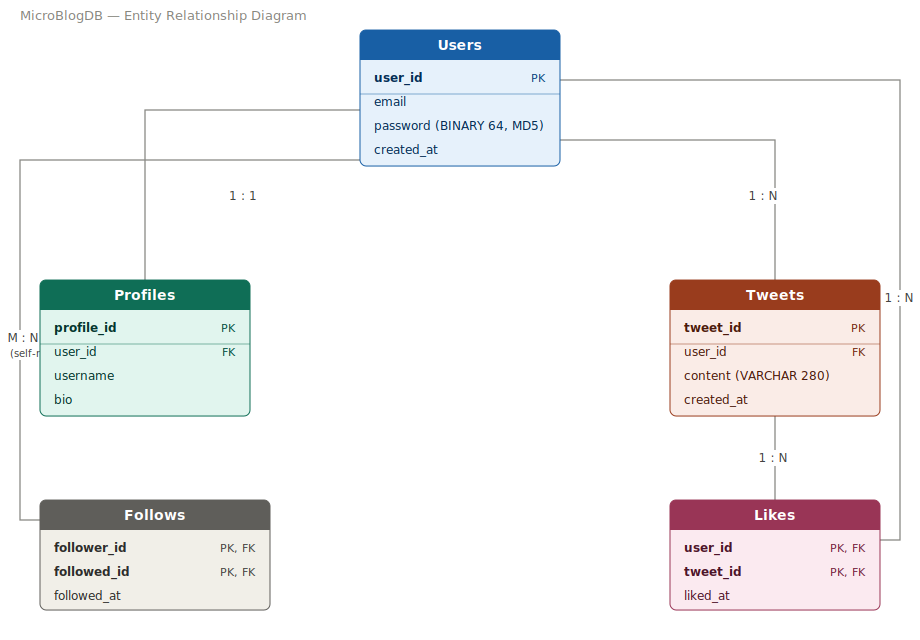

# MicroBlogDB

A simplified Twitter-like microblogging platform database, built in MySQL. The project covers ER design, table creation with proper foreign key relationships, password hashing, and stored procedures for common actions such as account creation and following users.


## Database Schema

The database consists of five tables:

| Table      | Description                                              |
|------------|-----------------------------------------------------------|
| `Users`    | Core account data: email, hashed password, creation date |
| `Profiles` | Public-facing profile info linked 1-to-1 with a user      |
| `Tweets`   | Posts created by users                                    |
| `Follows`  | Follower/following relationships between users             |
| `Likes`    | Records which users liked which tweets                     |
## Entity Relationships

- **Users ↔ Profiles** — one-to-one. Each user has exactly one profile.
- **Users ↔ Tweets** — one-to-many. A user can write many tweets.
- **Users ↔ Follows ↔ Users** — many-to-many, self-referencing. A user can follow many users and be followed by many users.
- **Users ↔ Likes ↔ Tweets** — many-to-many. A user can like many tweets, and a tweet can be liked by many users.

## Stored Procedures

### `createAccount(email, password, username, bio)`
Creates a new user and their profile in a single call. The password is hashed with MD5 before being stored as `BINARY(64)`.

```sql
CALL createAccount('sara@example.com', 'Sara@123', 'sara_dev', 'Developer and tech enthusiast');
```

### `User_Follow(follower_username, followed_username)`
Looks up the `user_id` for both usernames via the `Profiles` table and inserts the relationship into `Follows`.

```sql
CALL User_Follow('khalid_k', 'sara_dev');

## How to Run

1. Install MySQL and open MySQL Workbench (or the `mysql` CLI).
2. Run the full script:
   ```sql
   SOURCE MicroBlogDB.sql;
   ```
   or open `MicroBlogDB.sql` in Workbench and execute it.
3. The script will:
   - Create the `MicroBlogDB` database and all tables
   - Create the `createAccount` and `User_Follow` procedures
   - Insert sample users, tweets, follows, and likes
   - Display the contents of every table
   - Show the tweet count for a sample user (`sara_dev`)

## Example Query: Tweet Count for a Single User

```sql
SELECT p.username, COUNT(t.tweet_id) AS tweet_count
FROM Profiles p
JOIN Tweets t ON p.user_id = t.user_id
WHERE p.username = 'sara_dev'
GROUP BY p.username;
```

## Tech Stack

- MySQL 8.0+
- Stored procedures (SQL/PSM)
- MD5 password hashing

## Project Structure

```
MicroBlogDB/
├── README.md
├── MicroBlogDB.sql
└── docs/
    └── er_diagram.png
........................................................

